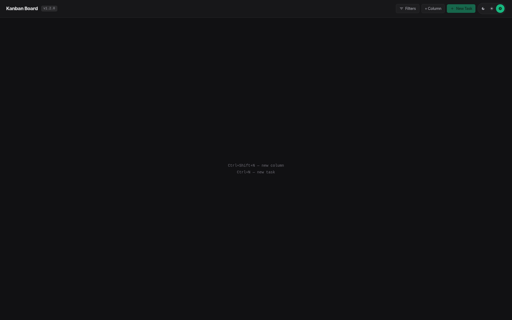
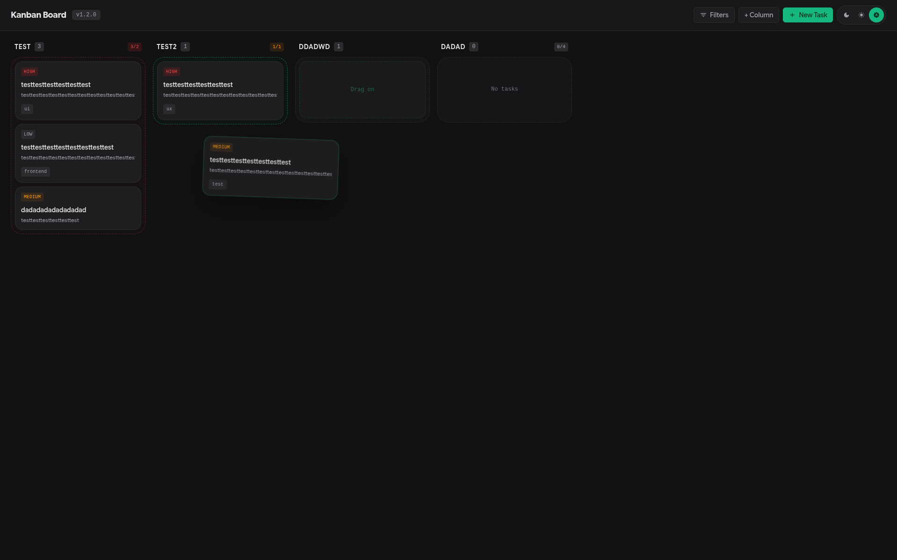
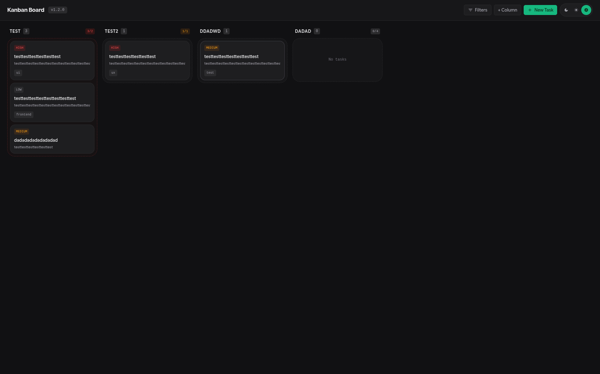
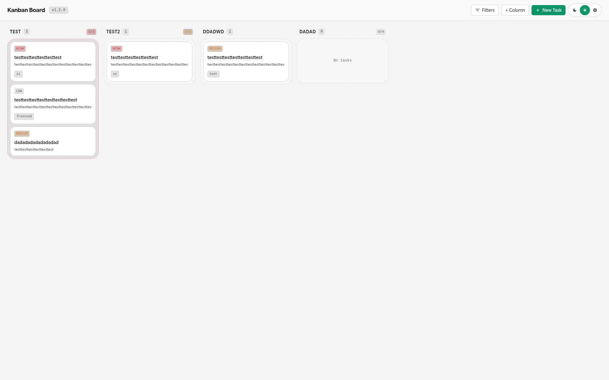
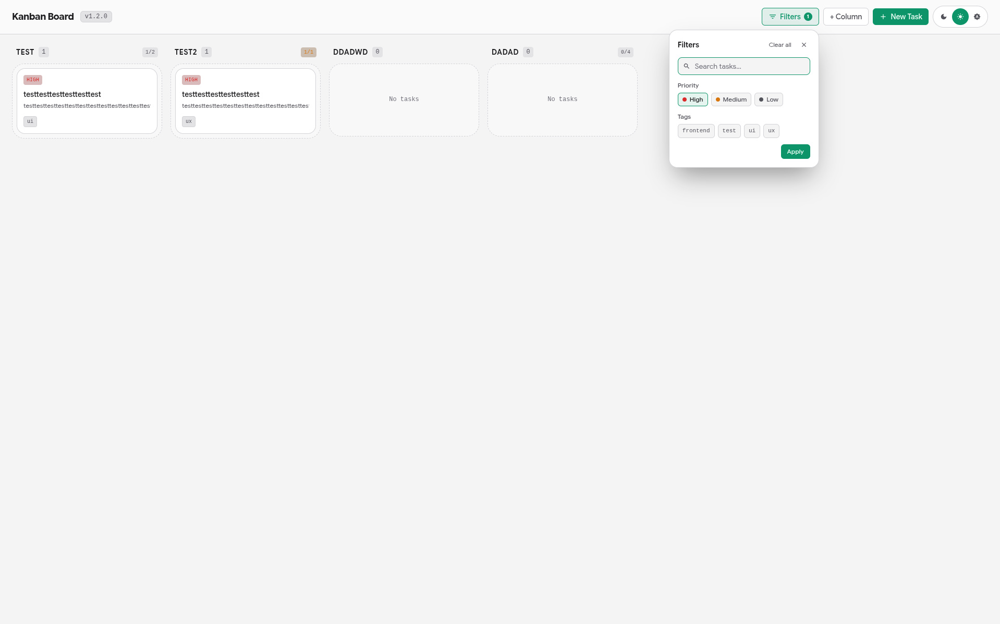
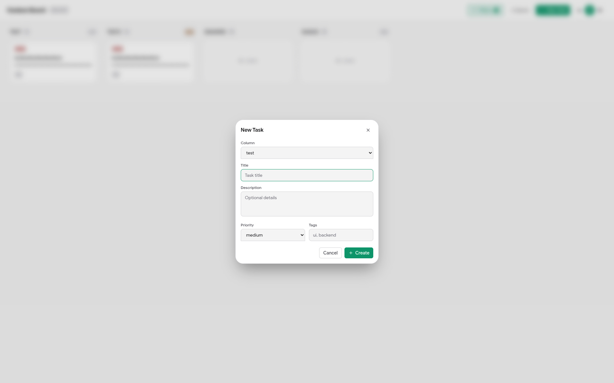

# Kanban Desktop

A local-first desktop kanban board app built with Tauri, React, and SQLite. No backend server, no cloud sync — your board data lives entirely on your machine.

- **Core/Backend:** Tauri (Rust)
- **Frontend:** React 19 + TypeScript + Vite + Tailwind CSS 4
- **Local DB:** SQLite via `rusqlite`
- **Package manager:** Bun

## Screenshots

<details>
<summary><b>Empty board</b></summary>



</details>

<details>
<summary><b>Drag & drop</b></summary>



</details>

<details>
<summary><b>Board with tasks</b></summary>



</details>

<details>
<summary><b>Light theme</b></summary>



</details>

<details>
<summary><b>Filters</b></summary>



</details>

<details>
<summary><b>Create task</b></summary>



</details>

## Install

<details open>
<summary><b>Download release</b></summary>

Grab the latest binary from the [Releases](https://github.com/mavxa/kanban-desktop/releases) page:

| Platform | File |
|----------|------|
| Windows | `.msi` or `setup.exe` |
| Linux | `.deb`, `.AppImage`, or `.rpm` |

No additional dependencies needed — the app bundles its own SQLite runtime.

</details>

<details>
<summary><b>Build from source</b></summary>

Prerequisites:

- [Bun](https://bun.sh)
- [Rust](https://rustup.rs)
- Linux: `build-essential`, `libwebkit2gtk-4.1-dev`, `libayatana-appindicator3-dev`, `librsvg2-dev`

Clone and build:

```sh
git clone https://github.com/mavxa/kanban-desktop.git
cd kanban-desktop
bun install
bun run tauri:build
```

The binary lands at `src-tauri/target/release/kanban-desktop`.

</details>

## Features

<details open>
<summary><b>Board</b></summary>

- Drag-and-drop task cards between columns via `dnd-kit`
- Create, edit, and delete columns with custom WIP limits
- Create, edit, and delete tasks with title, description, priority, and tags
- Persistent SQLite storage — all changes survive app restarts

</details>

<details open>
<summary><b>Filtering</b></summary>

- Text search across task titles, descriptions, and tags
- Filter by priority (low / medium / high)
- Filter by tags — auto-populated from all existing tasks
- Filters apply on panel close (Enter or Apply button)

</details>

<details open>
<summary><b>Theming</b></summary>

- Dark / light / auto modes
- Auto follows `prefers-color-scheme`
- Persisted in `localStorage`

</details>

## Keyboard Shortcuts

| Shortcut | Action |
|----------|--------|
| `Ctrl + Shift + N` | New column |
| `Ctrl + N` | New task (when columns exist) |
| `Enter` | Apply filters |
| `Escape` | Close any modal or filter panel |

## Stack

| Layer | Tech |
|-------|------|
| Desktop shell | Tauri v2 |
| UI framework | React 19 |
| Language | TypeScript 5.9 |
| Bundler | Vite 8 |
| Styling | Tailwind CSS 4.1 |
| State / queries | TanStack Query |
| Forms | TanStack Form + Zod |
| Drag & drop | dnd-kit |
| Icons | react-icons (Material Design) |
| DB | SQLite (`rusqlite` in Rust) |

## Development

```sh
# Frontend dev server
bun run dev

# Desktop app with hot reload
bunx tauri dev

# Lint
bun run lint

# Production build (frontend only)
bun run build

# Full desktop build
bun run tauri:build

# Rust checks
cd src-tauri && cargo check
```

## Architecture

```text
src/
  features/board/
    BoardScreen.tsx      # Root screen with modals and filters
    KanbanBoard.tsx      # DnD context and drag handlers
    BoardColumn.tsx      # Droppable column
    TaskCard.tsx         # Sortable task card
    FilterPanel.tsx      # Search + priority + tag filters
    TaskEditModal.tsx    # Edit / delete task
    ColumnEditModal.tsx  # Create / edit / delete column
    api.ts               # Tauri invoke wrappers
    queries.ts           # TanStack Query hooks
    types.ts             # Domain types
    schemas.ts           # Zod form schemas
  src-tauri/src/
    main.rs              # Tauri app entry
    lib.rs               # Commands (get_board_data, create_task, etc.)
    db/
      mod.rs             # Bootstrap (ensure board exists)
      connection.rs      # SQLite path + open
      migrations.rs      # PRAGMA user_version migrations
      repo.rs            # CRUD queries
      seed.rs            # Dev seed module (not called in production)
```

## CI / CD

GitHub Actions builds and publishes releases automatically on every `v*` tag push:

- `.github/workflows/ci.yml` — lint, build, `cargo check`
- `.github/workflows/release.yml` — cross-platform Tauri builds (Ubuntu + Windows) and GitHub Release publishing

## License

MIT
